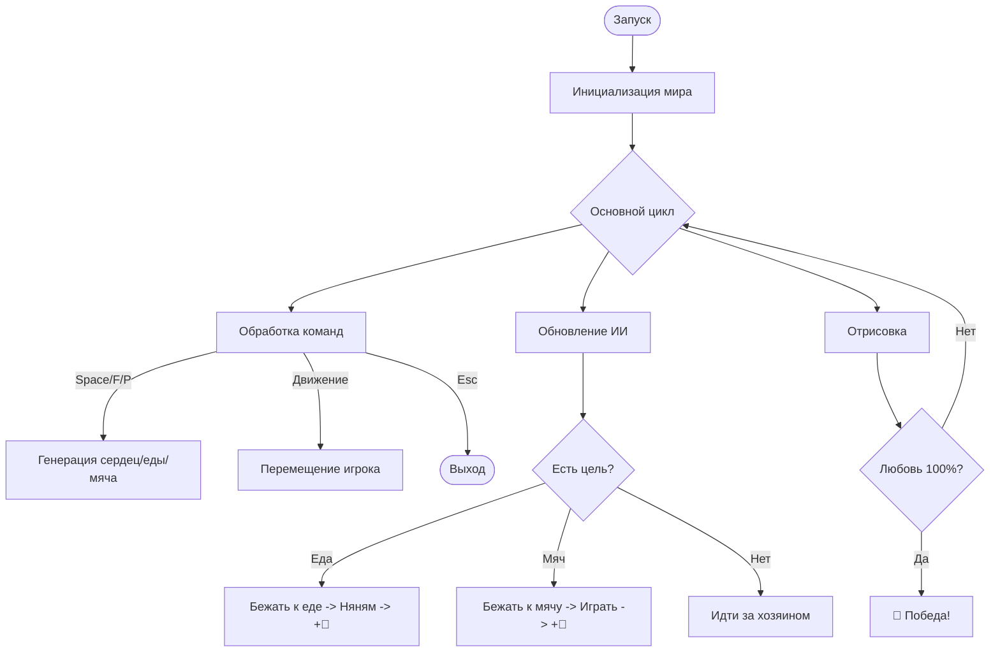

# 🐾 Верная любовь: Человек и Собака 💖

> **Специально к 14 февраля: история о самой искренней и бескорыстной любви.**


## 📖 О проекте
**"Верная любовь"** — это уютная мини-игра на Python, созданная в честь Дня святого Валентина. В то время как мир празднует романтическую любовь, эта игра напоминает нам о другом, не менее важном чувстве — глубокой привязанности между человеком и его четвероногим другом.

В этой игре вы — хозяин, который проводит время со своей собакой в парке. Ваша цель — сделать питомца максимально счастливым, окружая его заботой и вниманием.

---

## ✨ Основные особенности
*   **🌸 Уютная эстетика:** Нежная пастельная палитра (Lavender Blush и Hot Pink) создает расслабляющую атмосферу.
*   **🐕 Интерактивное поведение:** Собака следует за вами, реагирует на ваши действия, радуется еде и с азартом гоняется за мячиком.
*   **💝 Шкала любви:** Наполняйте сердце вашего питомца радостью. При достижении 100% вы получите звание "Лучший хозяин".
*   **✨ Эффекты частиц:** Каждое проявление любви сопровождается фонтаном анимированных сердечек.
*   **📸 Фото на память:** Сохраняйте счастливые моменты прямо во время игры.

---

## 📊 Логика игры


---

## 🕹 Управление
| Клавиша | Действие |
| :--- | :--- |
| `WASD` / `Стрелки` | Передвижение по парку |
| `Space` | Погладить собаку (когда вы рядом) |
| `F` | Дать вкусняшку (собака прибежит поесть) |
| `P` | Бросить мячик (игра в "принеси-подай") |
| `K` | Сделать скриншот (`happiness.png`) |
| `Esc` | Быстрый выход из игры |

---

## 🛠 Технологический стек
*   **Language:** Python 3.8+
*   **Engine:** Pygame
*   **Graphics:** Процедурная анимация и векторные примитивы в пастельных тонах.

---

## 🚀 Запуск игры

### 1. Подготовка окружения
Убедитесь, что у вас установлен Python. Установите библиотеку Pygame:
```bash
pip install pygame
```

### 2. Запуск
```bash
python main.py
```

---

## � Ваша цель
Наберите **100%** по шкале любви. Для этого:
1. Чаще подходите и гладьте собаку.
2. Не забывайте подкармливать её вкусняшками.
3. Играйте с мячиком — собаки это обожают!

---

**С любовью к собакам и чистому коду!** 🦴❤️
